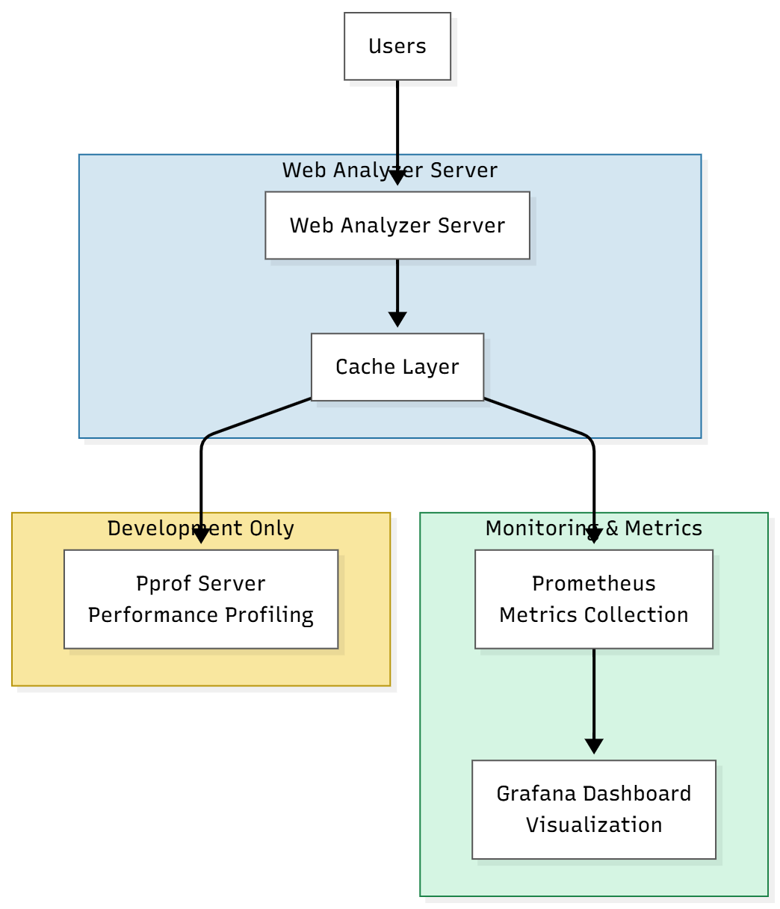
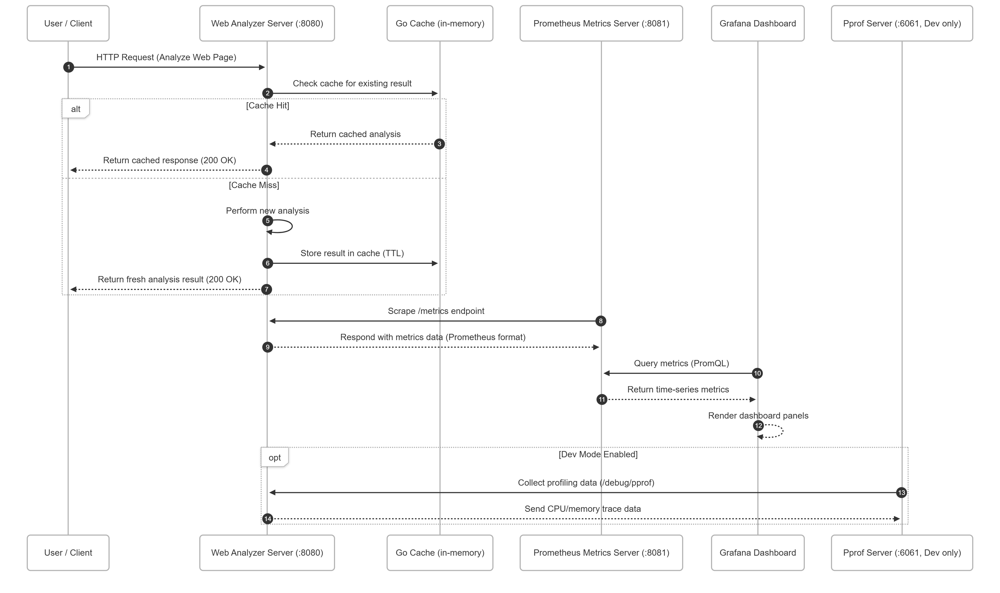
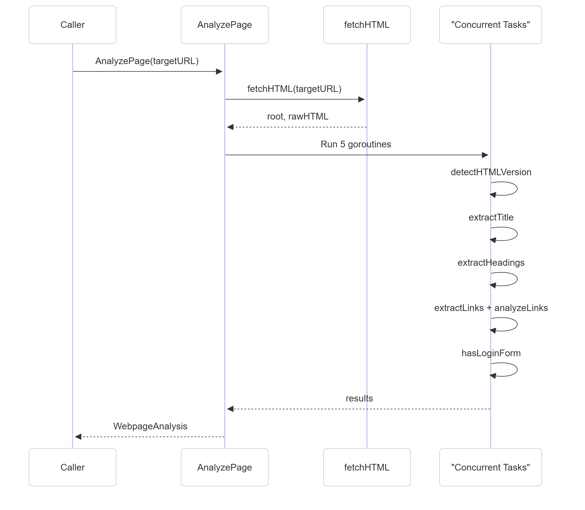
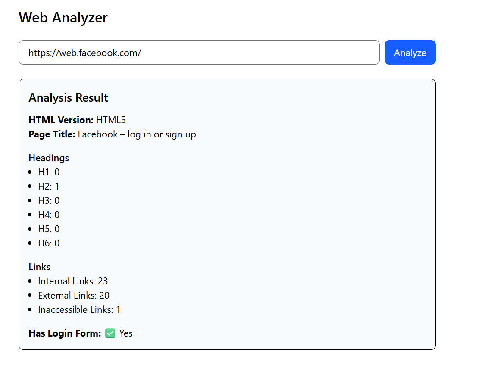

# Web Analyzer

A comprehensive web application for in-depth website analysis and link validation with advanced HTML parsing capabilities.


## Features

- Title Extraction: Extract and analyze page title metadata
- Header Structure Analysis: Count and categorize H1-H6 headers
- Internal links count
- External links count
- Inaccessible links identification
- Login Form Detection

## System Architecture

#### 🖼High-Level Architecture


####  High-Level Sequence Diagram


#### Request Flow



## Quick Start

### Running the Stack

```bash
  docker compose up --build

```

### Open in your browser
Service	URL	Description

Frontend (Svelte)	http://localhost:3000

Backend (Go)	http://localhost:8080

Prometheus	http://localhost:9090

Grafana	http://localhost:3001


## Tech Stack

**Client:** Svelte

**Server:** Go


## Screenshots



## Assumptions

- Static HTML Processing
  The system assumes the HTML content returned from the initial HTTP response is complete — it does not execute or process JavaScript (no browser-based rendering).
- Accessible Public Pages
  The target URLs are publicly accessible (no login/session/cookies or CAPTCHA-based restrictions).

## Enhancements

- JavaScript Rendering Support
Integrate a headless browser to analyze dynamically generated DOM content.

- Robots.txt and Sitemap Parsing
Respect crawling rules and discover site structure automatically.