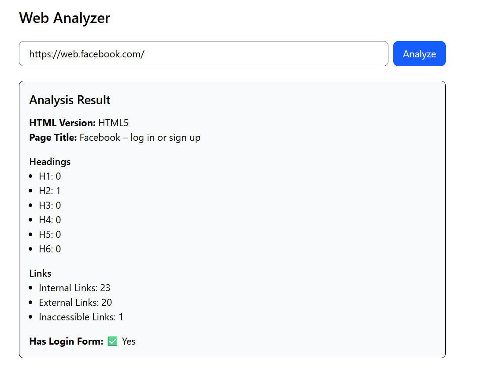

# Web Analyzer

A comprehensive web application for in-depth website analysis and link validation with advanced HTML parsing capabilities.


## Features

- Title Extraction: Extract and analyze page title metadata
- Header Structure Analysis: Count and categorize H1-H6 headers
- Internal links count
- External links count
- Inaccessible links identification
- Login Form Detection

## Quick Start

### Start development server
```bash
npm run dev
```

### Start with browser auto-open
```bash
npm run dev -- --open
```

### Production build
```bash
npm run build
```

### Preview production
```bash
npm run preview
```

## Tech Stack

**Client:** Svelte 

**Server:** Go


## Screenshots




